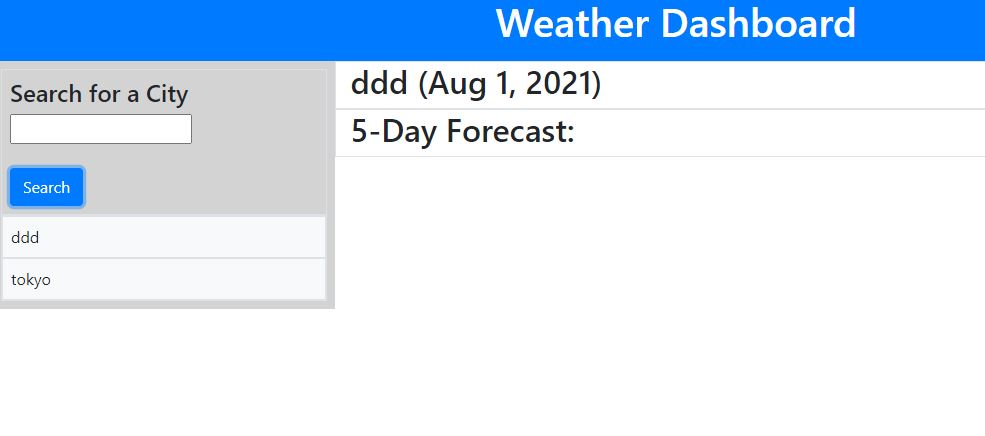

# Openweather
# Task
Create a third party APIs ( OpenWeather One Call API) at allow developers to access their data and functionality by making requests with specific parameters to a URL. Developers are often tasked with retrieving data from another application's API and using it in the context of their own. Your challenge is to build a weather dashboard that will run in the browser and feature dynamically updated HTML and CSS
# User Story
AS A traveler
I WANT to see the weather outlook for multiple cities
SO THAT I can plan a trip accordingly
# Acceptance Criteria
GIVEN a weather dashboard with form inputs
WHEN I search for a city
THEN I am presented with current and future conditions for that city and that city is added to the search history
WHEN I view current weather conditions for that city
THEN I am presented with the city name, the date, an icon representation of weather conditions, the temperature, the humidity, the wind speed, and the UV index
WHEN I view the UV index
THEN I am presented with a color that indicates whether the conditions are favorable, moderate, or severe
WHEN I view future weather conditions for that city
THEN I am presented with a 5-day forecast that displays the date, an icon representation of weather conditions, the temperature, the wind speed, and the humidity
WHEN I click on a city in the search history
THEN I am again presented with current and future conditions for that city
## Mock-Up

# Pseudo Code

# Register with open weather to get and activate the API key
# Determine from the mock up which style to use either containers sections labels or division
# Ensure the text area is set to input and verify data 
# enter prompt user enter and alert about invalid data 
# Try to get the website working before looking into details.
# create areas to display search list and made to function to click and search again
# area to display current and forecasted weather information
# Make UV index color coded red severe moderate yellow and favorable green
# test the fetch with example from fetch activity in class
# Apply examples for API lessons in class activities
### challenges
#Displaying both now and forecasted data access the API to get the correct information and put data in coorect formate
#Created and making a second call to fetch for UV index and creating a loop function
#Creating issues
#Making the key private on github

### Final ####

#### Issues
# Trying to find a validator for cities tried if city.name === null but didnt work
# Trying to prevent empty spaces from being appended ....didn't work
## Final Project Deployment
[Weather Dashboard](https://jahneo.github.io/NeilsWeather-Dashboard/)
#### Git Hub Deployment
[github](https://github.com/Jahneo/Openweather) 

### rename repository
##### Resources ###
#Boot cam API fetch and nested fetch activities
# Taskmaster Pro activity

#### Close Issues ###
## Reopen Issues ##